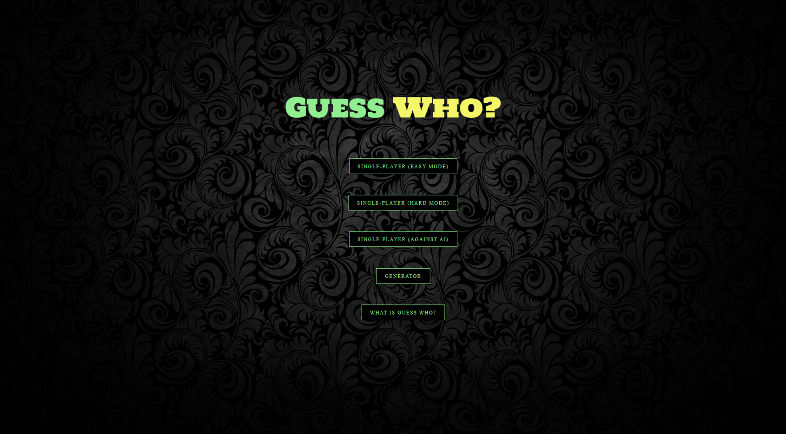
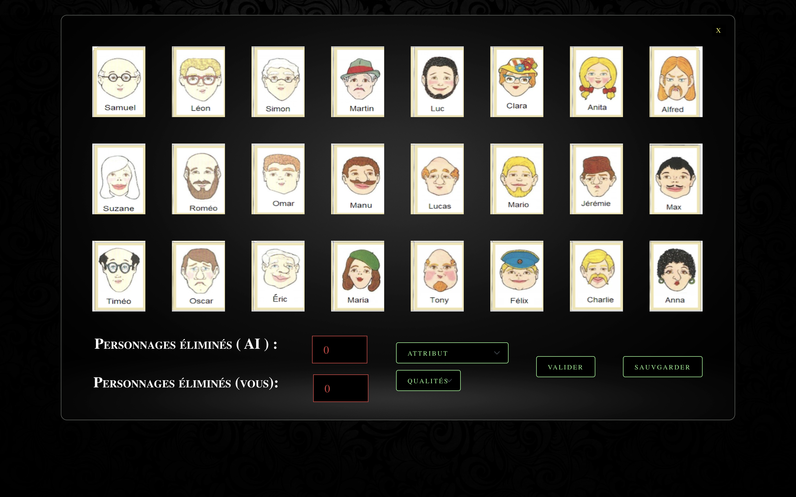
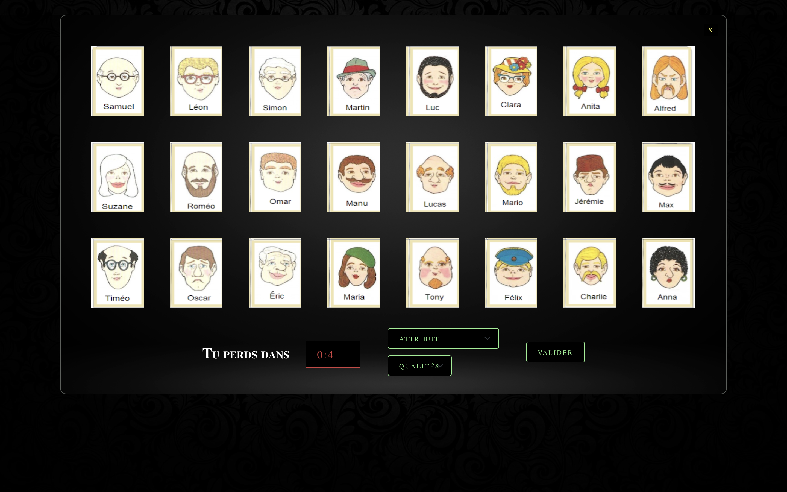

# Qui Est-Ce ?

Jeu de société où le but du jeu est de se montrer rusé en posant des questions qui se répondent que par oui ou non pour découvrir le personnage mystère de son adversaire. Version française.

## Exigences :

1. Linux ou MacOS
2. Node (version la plus récente)

## Pour installer le projet :

1. Ouvrir le dossier en utilisant votre terminal
2. Ecrire les commandes suivantes :
   $ npm install
   $ npm run dev

## Pour utiliser le générateur :

1. Il y a un dossier appelé "GEN-TEST" dans le projet avec des images pour tester le générateur.
2. Importez l'un des dossiers depuis le menu du jeu.
3. Vous pouvez ajouter autant d'attributs que vous le souhaitez.
4. Il y a un bouton de réinitialisation du jeu qui vous permet de revenir aux valeurs (images, attributs) par défaut.
